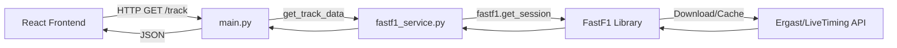

# 🚪 main.py – The API Gateway

This file is the **entry point** of your backend. It handles all incoming requests from the internet (or your React frontend) and decides which function should answer them.

**Location**: `backend/main.py`

---

## 📐 Architecture Flow



---

## 🏗️ 1. Setup & Configuration

```python
from fastapi import FastAPI
from fastapi.middleware.cors import CORSMiddleware
```
- **FastAPI**: The web framework we are using. It's like a waiter that takes orders (HTTP Requests) and brings food (JSON Data).
- **CORS**: "Cross-Origin Resource Sharing". Security feature.

```python
app = FastAPI()   # then fast api is just like template
```
**1. The Walls (The Server)**
The app = FastAPI() line creates a Python object that knows how to speak "HTTP".

When you run uvicorn main:app, Uvicorn (the engine) takes this object and opens a "socket" on port 8000.
Without it: You would have to write raw code like socket.bind(('localhost', 8000)) and manually parse bytes of data coming from the network card.

**2. The Doors (The Endpoints)**
The @app.get("/track/...") decorator is the "Door Sign".

FastAPI maintains a literal list (a "Router") inside the 
ap object.
When a request comes in for /track, it looks at its list: "Do I have a function for /track? Yes! It's get_track."
Without it: You would have to write a giant if/else block:
python
    if url == "/track":
    run_track_function()
    elif url == "/users":
     run_users_function()

**3. The Security System (Validation)**
This is the magic part: "year: int".

FastAPI uses a library called Pydantic to inspect your function arguments.
If a user sends /track/hello/12/R (where "hello" is the year), FastAPI intercepts it before it even reaches your function.
It checks: "Is 'hello' an integer? No." -> 422 Validation Error.
Without it: Your code would crash inside the function when you tried to do math with "hello", effectively crashing your whole server. FastAPI acts as a shield.


- **Line 7**: This creates the application. `uvicorn main:app` tells the server to look for this variable named `app`.

```python
app.add_middleware(
    CORSMiddleware,
    allow_origins=["*"], ...
)
```
- **Line 10-16**: **CRITICAL**.
- By default, browsers block websites (port 3000) from talking to servers (port 8000) to prevent hacking.
- `allow_origins=["*"]` disables this protection for development. It says "Anyone can talk to me".
-  # Allows all types of actions (GET, POST, PUT, DELETE).
---

## CORS (Cross-Origin Resource Sharing):
Browser security rule: frontend on http://localhost:3000 cannot call API at http://127.0.0.1:8000 unless backend allows it.

allow_origins=["*"] – allow all origins (any website can call this API).

allow_methods=["*"] – allow all HTTP methods (GET, POST, etc.).

allow_headers=["*"] – allow all custom headers.


CORS stands for Cross-Origin Resource Sharing.

Is it a "Middleman"? No. It is more like a Passport Control Officer located inside the Browser (Chrome/Edge).

## The Origin Concept:
An "Origin" is defined by 3 things: Protocol + Domain + Port.
http://localhost:3000 (React) and http://localhost:8000 (FastAPI) are Different Origins because the ports don't match.

## The Pre-Flight Check (OPTIONS Request):
Before your React app sends a real request (like GET /track), the Browser silently sends a "Pre-Flight" request (OPTIONS) to the server first.
Browser asks Server: "Hey, I am coming from port 3000. Do you allow visitors from port 3000?"

## The Server's Response (The Metadata):
This is where your CORSMiddleware comes in.
It intercepts that "Pre-Flight" request and replies with a special HTTP Header:
Access-Control-Allow-Origin: *
Translation: "Yes, I allow everyone."

## The Browser's Decision:
If the Server says "Yes", the Browser then allows the real JavaScript request to proceed.
If the Server says "No" (or doesn't reply), the Browser blocks the request and shows a terrifying red error in the console.
Why is it called Middleware? Because in FastAPI, "Middleware" is code that runs before every request and after every response. The CORSMiddleware sits there effectively stamping "Approved" on every response header so the browser doesn't complain.


## 🚦 2. Startup Logic

```python
@app.on_event("startup")
async def startup_db_client():
    await check_db_connection()
```
- **Line 19**: Runs **once** when you press "Run".
- Used to connect to the database *before* the first user arrives.

---

## 🔗 3. The Endpoints (Routes)

An "Endpoint" is a URL like `google.com/search`. You define what happens when someone visits a specific URL.

### 🏠 Root (`/`)
```python
@app.get("/")
async def root():
    return {"message": "F1 Race Replay API is Live! 🏎️"}
```
- **Line 24**: If you visit `http://localhost:8000/`, you see this message. It's a "Heatlh Check" to prove the server is alive.

### 📅 Calendar (`/races/{year}`)
```python
@app.get("/races/{year}")
async def get_race_calender(year: int):
   return await get_race_calendar(year)
```
- **Line 42**:
    - `{year}` is a **Path Parameter**.
    - If user visits `/races/2023`, FastAPI captures `"2023"`.
    - `year: int`: It automatically converts the string "2023" into the number `2023`.
    - Then it calls `get_race_calendar(2023)` from our service file.

### 🗺️ Track Map (`/track/...`)
```python
@app.get("/track/{year}/{round}/{session}")
async def get_track(year: int, round: int, session: str):  ##This is the API handler function.  get_telemetry_endpoint

# This is just the name of your endpoint function.
# Call it whatever you want, but name should describe what it does.

    return await get_track_data(year, round, session)
```
- **Line 50**: Matches URLs like `/track/2023/12/R`.
- Notice how clean `main.py` is? It contains **NO LOGIC**.
- It simply takes the inputs (`2023`, `12`, `R`) and passes them to the **Worker** (`fastf1_service.py`).
- **Design Pattern**: This is "Separation of Concerns". The API layer (Receptionist) shouldn't know how to download F1 data; it just knows who to ask.

### 🏎️ Telemetry (`/telemetry/...`)
```python
@app.get("/telemetry/{year}/{round}/{session}/{driver}")
```
- **Line 58**: Fetches car data for a single driver.

It expects 4 variables in the URL path.
Real Example: http://localhost:8000/telemetry/2023/12/R/1

## The Function (get_telemetry_endpoint):
Async: It handles the web request without blocking other users.
Arguments: FastAPI automatically extracts the 4 numbers/strings from the URL and puts them into the variables year, round, 
session,driver.

## The Action (await get_lap_telemetry):
It calls your service function (which you imported at the top of the file).
That service function runs the heavy FastF1 logic:
Loads the race.
Finds Driver #1.
Calculates Speed/Throttle/GPS for every 0.3s.
Returns a JSON list: [{"time": 0.1, "x": 100, "y": 200}, ...].

## The Result:
The frontend receives that JSON list and uses it to animate the dot moving across the screen.
---

## 🧪 How to modify
If you want to add a new feature, like "Get Driver Profile":

1.  **Define the URL**: `@app.get("/driver/{name}")`
2.  **Define the Function**: `async def get_driver(name: str):`
3.  **Call the Service**: `return await get_driver_info(name)`
