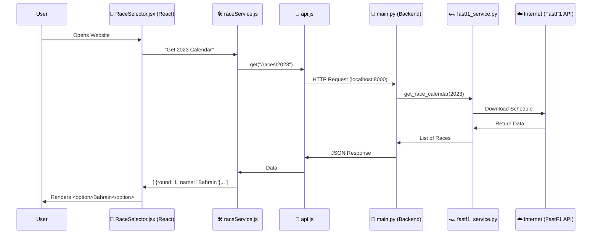

# 🌊 Data Flow Explanation: "How the Race List Appears"

This document traces the exact path of data when you open the app, ensuring you understand "what file does what".

**The Goal**: Show the list of 2023 Races in the dropdown menu.

---

## 🗺️ Visual Map (The Pipeline)



---

## 🔍 Step-by-Step File Breakdown

### Step 1: `ui/src/components/RaceSelector.jsx` (The Trigger)
This is the **Frontend Component** that the user sees.

1.  **Mounting**: When the page loads, `useEffect` runs.
2.  **The Call**: It executes `raceService.getCalendar(2023)`.

```javascript
// ui/src/components/RaceSelector.jsx

useEffect(() => {
    // This runs ONCE when the specific component loads
    const fetchRaces = async () => {
        // Calls the service
        const data = await raceService.getCalendar(2023);
        // Saves data to state (updating the screen)
        setRaces(data); 
    };
    fetchRaces();
}, []);
```

### Step 2: `ui/src/services/raceService.js` (The Manager)
This file organizes all API calls. It keeps components clean.

```javascript
// ui/src/services/raceService.js

export const raceService = {
    getCalendar: async (year) => {
        // Asks the API utility to do the work
        const response = await api.get(`/races/${year}`);
        return response.data;
    }
};
```

### Step 3: `ui/src/services/api.js` (The Messenger)
This is a small utility that knows *where* the backend is.

```javascript
// ui/src/services/api.js

// Configures "axios" (the library that makes HTTP requests)
const api = axios.create({
    baseURL: 'http://127.0.0.1:8000', // Points to Python Entry
});
```
*   **Result**: It sends a network request to `http://127.0.0.1:8000/races/2023`.

---

### Step 4: `backend/main.py` (The Receptionist)
The request hits the Python server here.

```python
# backend/main.py

# Matches the URL "/races/2023"
@app.get("/races/{year}") 
async def get_race_calender(year: int):
   # Passes the work to the "Specialist" (FastF1 Service)
   return await get_race_calendar(year)
```

### Step 5: `backend/services/fastf1_service.py` (The Worker)
This file actually does the heavy lifting.

```python
# backend/services/fastf1_service.py

async def get_race_calendar(year: int):
    # 1. Downloads the schedule from the internet
    schedule = fastf1.get_event_schedule(year)

    # 2. Cleans it up (loops through rows)
    races = []
    # note: we optimized this to use itertuples() later!
    for i, row in schedule.iterrows():
        # Creates a nice clean dictionary for React
        races.append({
            "round": int(row["RoundNumber"]),
            "name": row["EventName"],
            "location": row["Location"],
            "date": str(row["EventDate"].date())
        })

    # 3. Returns the list
    return races
```

---

### Step 6: The Return Trip ↩️

1.  The list of races `[...]` goes from **Python** -> **React** (via HTTP).
2.  `RaceSelector.jsx` receives the data.
3.  It updates its `races` state: `setRaces(data)`.
4.  **React re-renders**: The HTML updates to show the options.

```javascript
// ui/src/components/RaceSelector.jsx

// The state 'races' now has data. specific Map loops over it and creates options.
{races.map((race) => (
    <option key={race.round} value={race.round}>
        Round {race.round}: {race.name}
    </option>
))}
```

That is exactly how "Bahrain Grand Prix" ends up on your screen!
