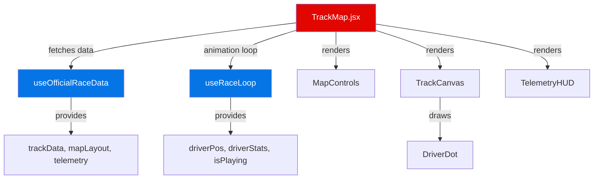
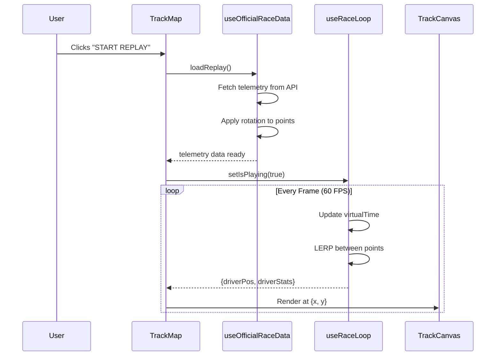

# 🗺️ TrackMap Component Documentation

## Overview

**`TrackMap.jsx`** is the **main orchestrator** component that manages the entire F1 race replay visualization. It acts as a "manager" that coordinates data fetching, animation, and rendering—without handling the low-level drawing or calculations itself.

---

## 🧩 Component Architecture



### Component Hierarchy

```
TrackMap (Orchestrator)
├── MapControls (UI Controls)
├── TrackCanvas (SVG Renderer)
│   └── DriverDot (Car Position)
└── TelemetryHUD (Live Stats Display)
```

---

## 🎯 Core Responsibilities

| Responsibility | Description |
|----------------|-------------|
| **Data Coordination** | Calls `useOfficialRaceData` hook to fetch track layout and telemetry |
| **Animation Management** | Uses `useRaceLoop` hook to run the 60 FPS animation engine |
| **State Management** | Manages playback speed and UI state |
| **Component Composition** | Passes data down to child components for rendering |

---

## 🔌 Props

```jsx
<TrackMap 
  year={2024}         // Season year
  round={1}           // Race round number
  session="R"         // Session type (R=Race, Q=Qualifying, etc.)
/>
```

| Prop | Type | Required | Description |
|------|------|----------|-------------|
| `year` | `number` | ✅ | F1 season year (e.g., 2024) |
| `round` | `number` | ✅ | Race round/event number (1-24) |
| `session` | `string` | ❌ | Session code: `R` (Race), `Q` (Qualifying), `FP1/2/3` |

---

## 📊 Data Flow

### 1️⃣ **Track Data Fetching** (`useOfficialRaceData`)

```javascript
const {
    trackData,        // Raw track info (circuit name, rotation angle)
    mapLayout,        // Processed SVG data (viewBox, path, size)
    telemetry,        // Driver telemetry array (x, y, speed, rpm, etc.)
    loading,          // Loading state
    loadReplay,       // Function to load telemetry
} = useOfficialRaceData(year, round, session);
```

#### What it does:
- Fetches track coordinates from backend
- **Pre-rotates** track using FastF1's official rotation angle
- Computes SVG viewBox and path for rendering
- Fetches telemetry data on demand
- Applies rotation to telemetry to match track orientation

---

### 2️⃣ **Animation Loop** (`useRaceLoop`)

```javascript
const {
    driverPos,        // Current {x, y} coordinates
    driverStats,      // Current {speed, rpm, gear, throttle, brake}
    isPlaying,        // Animation state
    setIsPlaying      // Play/pause control
} = useRaceLoop(telemetry, playbackSpeed);
```

#### What it does:
- Runs `requestAnimationFrame` loop at ~60 FPS
- Tracks "virtual race time" (0.0s → max)
- **Interpolates (LERP)** between telemetry points for smooth motion
- Updates driver position and stats every frame

---

### 3️⃣ **Local State**

```javascript
const [playbackSpeed, setPlaybackSpeed] = useState(1);
```

- Controls replay speed multiplier (1x, 2x, 5x, 10x)
- Used by `useRaceLoop` to scale virtual time progression

---

## 🎨 Rendering Logic

### Loading State

```jsx
if (loading) return <div>Loading Layout...</div>;
if (!mapLayout) return null;
```

Shows loading indicator while fetching track data.

---

### Main Container

```jsx
<div style={{
    width: '100%',
    height: '75vh',
    background: '#111',
    borderRadius: '16px',
    border: '1px solid #333',
    position: 'relative'
}}>
```

- **Dark theme** with rounded borders
- **Relative positioning** for absolute-positioned overlays
- **75vh height** for responsive sizing

---

### Child Components

#### 1. **MapControls** (Top Overlay)
```jsx
<MapControls
    circuitName={trackData.circuit}
    playbackSpeed={playbackSpeed}
    setPlaybackSpeed={setPlaybackSpeed}
    isPlaying={isPlaying}
    loadReplay={handleStartReplay}
    hasTelemetry={!!telemetry}
/>
```

**Purpose:** Displays circuit name and playback speed controls.

---

#### 2. **Big Play Button** (Center Overlay)
```jsx
{!isPlaying && (
    <button onClick={handleStartReplay}>
        <Play size={24} />
        {telemetry ? "RESUME REPLAY" : "START REPLAY"}
    </button>
)}
```

**Purpose:** Large center button to start/resume replay (shown when paused).

---

#### 3. **TelemetryHUD** (Bottom-Right Overlay)
```jsx
{driverStats && isPlaying && (
    <TelemetryHUD
        speed={driverStats.speed}
        gear={driverStats.gear}
        rpm={driverStats.rpm}
        throttle={driverStats.throttle}
        brake={driverStats.brake}
    />
)}
```

**Purpose:** Shows live telemetry (speed, gear, RPM, pedals) during replay.

**Condition:** Only renders when:
- `driverStats` exists (data is loaded)
- `isPlaying` is `true` (replay is active)

---

#### 4. **TrackCanvas** (Main SVG)
```jsx
<TrackCanvas
    mapLayout={mapLayout}
    driverPos={driverPos}
/>
```

**Purpose:** Renders the track circuit path and driver dot.

---

## 🔄 Key Functions

### `handleStartReplay()`

```javascript
const handleStartReplay = () => {
    loadReplay().then(() => {
        setIsPlaying(true);
    });
};
```

**Triggered by:** Play button clicks  
**Flow:**
1. Calls `loadReplay()` to fetch telemetry (if not already loaded)
2. Waits for telemetry to load (Promise)
3. Sets `isPlaying(true)` to start animation loop

---

## 🧮 Official Rotation System

### How it Works

1. **Backend provides rotation angle** (e.g., `+45°`)
2. **`useOfficialRaceData` applies rotation matrix** to every track point:
   ```javascript
   x' = x * cos(θ) - y * sin(θ)
   y' = x * sin(θ) + y * cos(θ)
   ```
3. **Telemetry points are rotated** using the same angle
4. **Result:** Track is "upright" by default, no manual rotation needed

> ⚠️ **Manual rotation is disabled** in the official version (`shouldRotate: false`)

---

## 📂 Related Files

| File | Purpose |
|------|---------|
| [useOfficialRaceData.js](file:///c:/Users/XEON DARK/Desktop/F1_REPLAY/ui/src/hooks/useOfficialRaceData.js) | Fetches and pre-processes track/telemetry data |
| [useRaceLoop.js](file:///c:/Users/XEON DARK/Desktop/F1_REPLAY/ui/src/hooks/useRaceLoop.js) | Animation engine with LERP interpolation |
| [MapControls.jsx](file:///c:/Users/XEON DARK/Desktop/F1_REPLAY/ui/src/components/Track/MapControls.jsx) | UI controls (speed, circuit name) |
| [TrackCanvas.jsx](file:///c:/Users/XEON DARK/Desktop/F1_REPLAY/ui/src/components/Track/TrackCanvas.jsx) | SVG renderer for track and driver |
| [DriverDot.jsx](file:///c:/Users/XEON DARK/Desktop/F1_REPLAY/ui/src/components/Track/DriverDot.jsx) | Animated driver position indicator |
| [TelemetryHUD.jsx](file:///c:/Users/XEON DARK/Desktop/F1_REPLAY/ui/src/components/TelemetryHUD.jsx) | Live telemetry display |

---

## 🎬 Animation Pipeline



---

## 🔧 Customization Guide

### Change Playback Speeds

Edit the speed buttons in [MapControls.jsx:L76-79](file:///c:/Users/XEON DARK/Desktop/F1_REPLAY/ui/src/components/Track/MapControls.jsx#L76-L79):

```jsx
<SpeedBtn val={1} ... />
<SpeedBtn val={2} ... />
<SpeedBtn val={5} ... />
<SpeedBtn val={10} ... />
```

Add more options like `3x`, `20x`, etc.

---

### Change Container Size

Modify the height in [TrackMap.jsx:L71](file:///c:/Users/XEON DARK/Desktop/F1_REPLAY/ui/src/components/TrackMap.jsx#L71):

```jsx
height: '75vh',  // Change to '90vh', '500px', etc.
```

---

### Show HUD When Paused

Remove the `isPlaying` condition in [TrackMap.jsx:L118](file:///c:/Users/XEON DARK/Desktop/F1_REPLAY/ui/src/components/TrackMap.jsx#L118):

```jsx
// Before
{driverStats && isPlaying && <TelemetryHUD ... />}

// After (always show if data exists)
{driverStats && <TelemetryHUD ... />}
```

---

## 🐛 Common Issues

### Issue: Play button does nothing
**Cause:** Telemetry failed to load  
**Solution:** Check browser console for API errors

### Issue: Car jumps/stutters
**Cause:** Low telemetry sampling rate  
**Solution:** Backend downsamples data (`::2`, `::3`). Use `::1` for smoother motion (larger files)

### Issue: Track appears rotated incorrectly
**Cause:** Backend rotation angle is wrong  
**Solution:** FastF1 provides official angles; verify backend is applying correctly

---

## 💡 Performance Notes

- **60 FPS target** via `requestAnimationFrame`
- **LERP interpolation** smooths motion between sparse telemetry points
- **SVG rendering** is GPU-accelerated in modern browsers
- **Telemetry size** affects load time (typically 200KB-500KB per lap)

---

## 🚀 Future Enhancements

- [ ] Multi-driver support (show all 20 cars)
- [ ] Lap time comparison overlay
- [ ] Rewind/scrub timeline
- [ ] Corner names and sector timing
- [ ] Minimap view toggle
